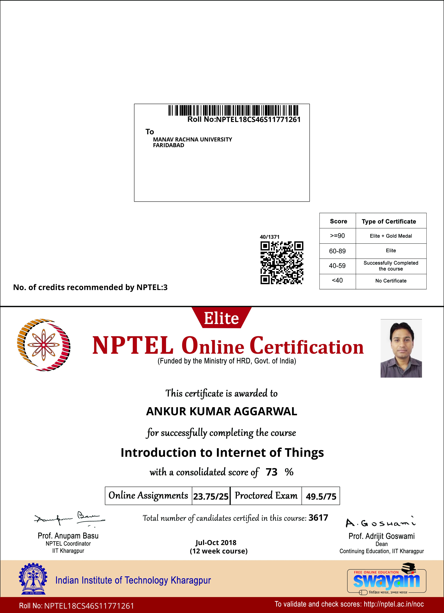
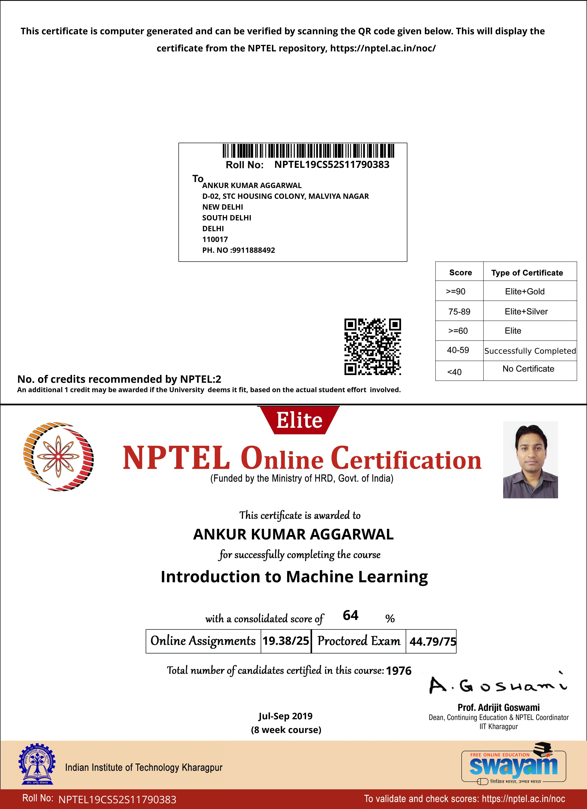

# Ankur Kumar Aggarwal Certificate_NPTEL-SWAYAM portal

## 1. Introduction to Modern Application Development Course certificate completed on Feb-March 2018
###### ROLL NO: NPTEL18CS03S1680663

## 2. Information Security - IV Course certificate completed on Feb-March 2018
###### ROLL NO: NPTEL18CS24S3680547

## 3. Data Base Management System Course certificate completed on Aug-Sept 2018
###### ROLL NO: NPTEL18CS36S11280275

## 4. Introduction to Internet of Things Course certificate completed on Aug-Sept 2018
###### ROLL NO: NPTEL18CS46S11771261

## 5. Introduction to R Software Course certificate completed on Feb-March 2018
###### ROLL NO: NPTEL18CS52S21280283

## 1. Introduction to Machine Learning Course certificate completed on Feb-March 2018
###### ROLL NO: NPTEL19CS52S11790383

